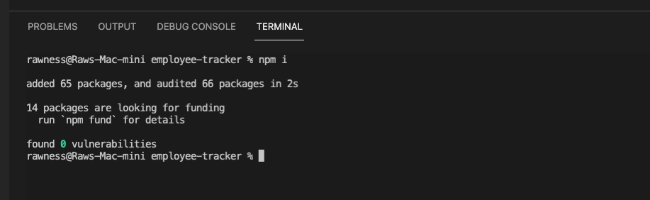
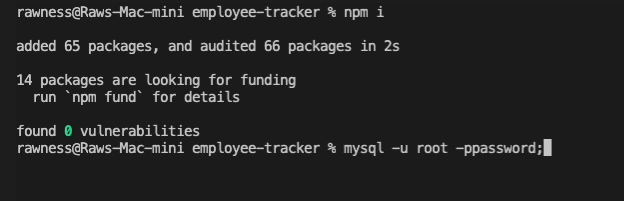
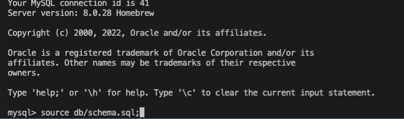
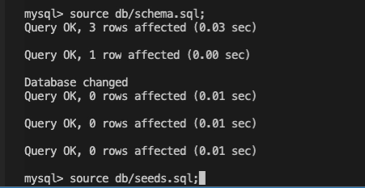
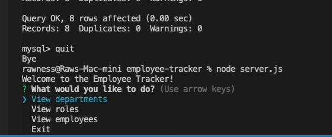

### About Employee Tracker

Click the GIF to watch a video on the installation and use (no audio) of Employee Tracker:

Table of Contents

  <ol>
    <li><a href="#description">Description</a></li>
    <li><a href="#built-with">Built With</a></li>
    <li><a href="#installation">Installation</a></li>
    <li><a href="#usage">Usage</a></li>
    <li><a href="#future-updates">Future Updates</a></li>
  </ol>

## Description

Employee Tracker allows you to access an employee database and view various tables within it.

## Built With

This application was built with MySQL2, Inquirer, and JavaScript.

## Installation

Node.js installation is required. After cloning this repository, open the folder containing the server.js file in your command line application. Then run 'npm i'. This will install inquirer and mysql2.

Log into MySQL. 

Run db/schema.sql 

and then db/seeds.sql.

This will create the employees database and seed it with values.

## Usage

After quitting MySQL, run the command line 'node server.js'. You will see a message greeting you and present you with four choices. The first three will allow you to view specific tables. Use the arrows keys to select and enter to choose. After viewing a table, you will be asked again what you would like to do. Choosing the last option will exit you out of the application.

## Future Updates

<ul>
  <li>Add, remove, and update values within the tables</li>
  <li>Join tables so certain id's are represented by their specific values</li>
  <li>Implement Express</li>
  <li>Use environment variable</li>
</ul>

